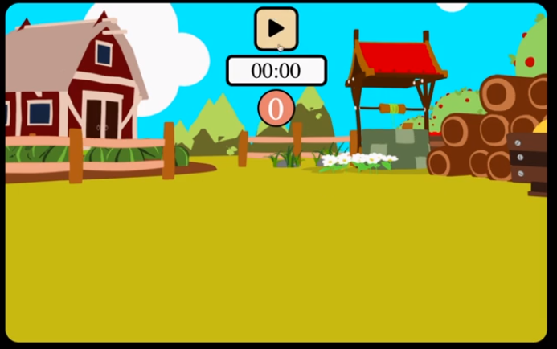
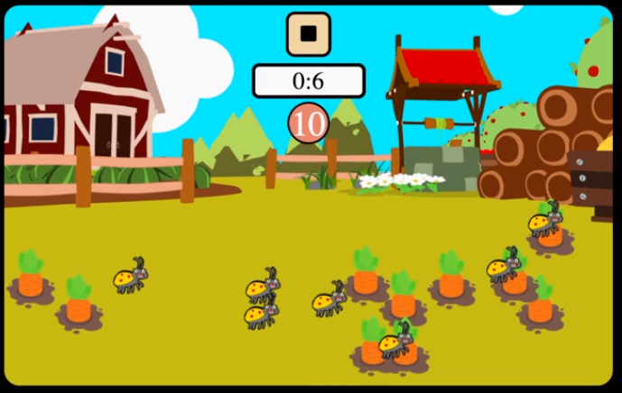
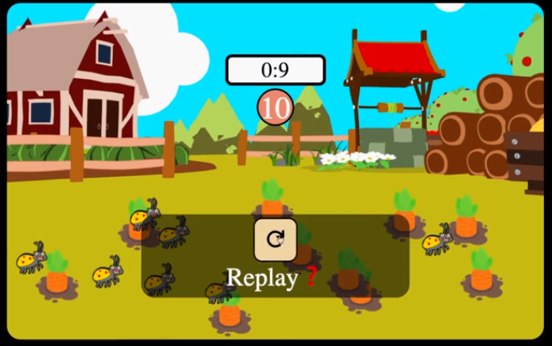
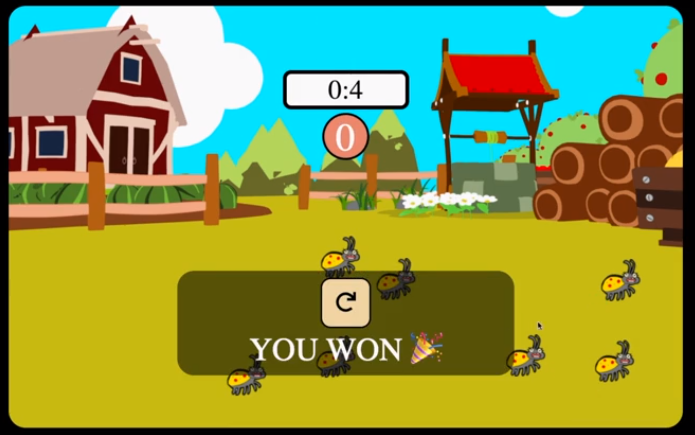
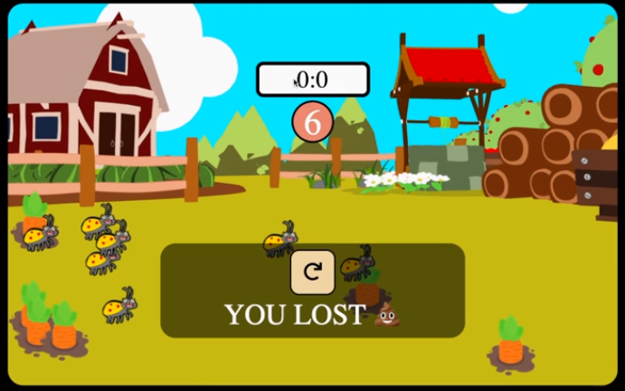
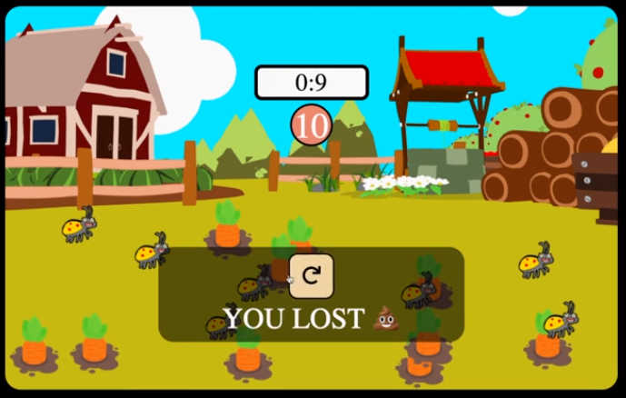
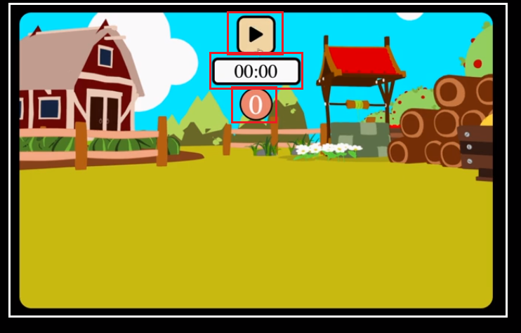
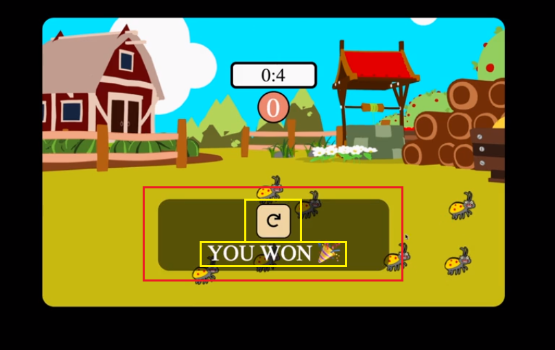
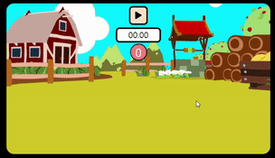

# 🥕 당근 뽑기 게임

- ### 프로젝트 소개

  게임을 시작하면 필드 내 랜덤한 위치에 일정한 수의 당근과 벌레들이 생성되고, 제한 시간 안에 벌레들을 피해 생성된 당근을 모조리 뽑아버리면 이기는 간단한 게임이다.

- ### 사용 언어 및 기술 : HTML, CSS, Javascript

- ### 게임 화면 구성

  |                  |                           |                           |
  | :--------------: | :-----------------------: | :-----------------------: |
  |    초기 화면     |      게임 진행 화면       |      게임 정지 화면       |
  | 게임 클리어 화면 | 게임 패배 화면(시간 초과) | 게임 패배 화면(벌레 물림) |
  |                  |                           |                           |

    
    
    
    
    
    

- ### Wireframe

    
    

- ### 요구 기능 분석 및 요약

  1.  사용자는 게임 시작 버튼을 클릭하여 게임을 진행할 수 있다.
  2.  게임을 시작하면 게임에 필요한 각종 설정들(배경음, 타이머 등)이 초기화되고 필드 내 랜덤한 위치에 일정한 수의 당근과 벌레들이 나타난다.
  3.  사용자는 생성된 당근이나 벌레들을 클릭할 수 있다.
  4.  사용자는 정지 버튼을 클릭하여 게임을 종료할 수 있다.
  5.  게임이 종료되면 종료된 상황에 따라 각기 다른 팝업 메시지를 출력한다.
  6.  사용자는 출력된 팝업 메시지 내 재시작 버튼을 클릭하여 게임을 재시작할 수 있다.

- ### 세부 사항 정리

  - 게임 시작 시

    1. 시작 버튼 아이콘을 정지 버튼 아이콘으로 변경한다.
    2. 타이머 바의 값은 10초로 초기화하여 표시한다.
    3. 당근 카운트 바의 값은 10으로 초기화하여 표시한다.
    4. 이전에 생성한 당근과 벌레 요소들이 화면에 남아있는 경우 남은 요소들을 모두 제거한다.
    5. 지정한 구간 내에 랜덤한 좌표 값들을 얻어 각 지점에 새로운 당근(10개)과 벌레(7개) 요소들을 생성하여 추가한다.
    6. 배경음을 재생하고 배경음 외에 다른 효과음이 재생 중이라면 해당 효과음을 정지시킨다.

  - 게임 진행 중

    1. 매초 타이머 바의 값을 변경하는 함수를 호출하여 현재 남은 시간을 표시한다. 값이 0이 되었을 경우 게임 실패 팝업 메시지를 띄우고 게임을 종료한다.
    2. 게임 필드에 클릭 이벤트가 발생하면 해당 지점의 요소 정보에 따라 다음 중 하나를 수행한다.

       - 이벤트 발생 요소가 당근일 경우 뽑히는 효과음과 함께 해당 요소를 제거하고 당근 카운트 바의 표시 값을 1만큼 감소한 값으로 변경한다.
       - 이벤트 발생 요소가 벌레일 경우 벌레용 효과음과 함께 게임 실패 팝업 메시지를 띄우고 게임을 종료한다.

  - 게임 종료 시
    1. 게임 시작/정지 버튼을 화면에서 제거한다.
    2. 게임 종료를 알리는 팝업 메세지를 출력한다.
       - 당근을 모두 뽑은 경우 승리 배경음과 함께 게임 clear 문구를 표시한다.
       - 시간 초과나 벌레를 클릭한 경우 실패 문구를 표시한다.
       - 정지 버튼으로 게임을 종료한 경우 정지 효과음과 함께 재시작을 묻는 문구를 표시한다.
    3. 팝업 메세지 내 리플레이 버튼을 클릭하면 게임을 다시 시작할 수 있다.

- ### 게임 플레이 영상

    

- ### 새롭게 알게된 점

1.  게임 종료 시 나타나는 팝업 메세지를 구현하며 팝업창과 모달창에 대해 알게 되었고, 해당 메세지를 모달창으로 구현하는 과정에서 z-index 속성을 이해하기 위해 Stacking Context에 대해 공부하였다.

    - [Pop-up vs Modal](https://github.com/he11/Js-Tech-Notes/blob/master/Web/FrontEnd/popup_vs_modal.md)
    - [Stacking Context](https://github.com/he11/Js-Tech-Notes/blob/master/Web/FrontEnd/stacking_context.md)

- ### 프로젝트 자료

  드림 코딩 by엘리 - [브라우저 101 강의](https://academy.dream-coding.com/courses/browser101)
